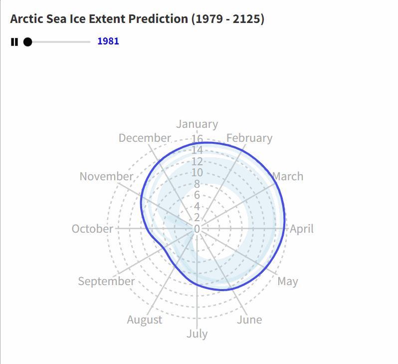

# Prediction of Sea Ice in Northern Hemisphere

### Introduction

Sea ice is frozen sea water that floats on the surface of ocean. This floating ice has a profound influence on the polar environment, influencing ocean circulation, weather, and regional climate.

Sea ice also plays a fundamental role in polar ecosystems. The ice itself is habitat for animals such as seals, Arctic foxes, polar bears, and penguins. When the ice melts in the summer, it releases nutrients into the water, stimulating the growth of phytoplankton, the center of the marine food web. As the ice melts, it exposes ocean water to sunlight, spurring photosynthesis in phytoplankton. When ice freezes, the underlying water gets saltier and sinks, mixing the water column and bringing nutrients to the surface. 

The influence of sea ice on the Earth is global. The white surface reflects far more sunlight back to space than ocean water does. Once sea ice begins to melt, a self-reinforcing cycle often begins. As more ice melts and exposes more dark water, the water absorbs more sunlight. The sun-warmed water then melts more ice. Over several years, this positive feedback cycle can influence global climate. So it is important to predict the sea ice in the polar regions.

# Goal of the project

1. Prediction of change in the sea ice extent of Northern Hemisphere till 2122 using time series analysis
2. Analysis of sea ice extent in three main regions of Northern Hemisphere
3. Visualization of the change of sea ice extent

## Requirements

- pyenv
- python==3.9.4

## Setup

For this purpose you use following commands:

```bash
python -m venv .venv
source .venv/bin/activate
pip install --upgrade pip
pip install -r requirements.txt
```

### Unit testing (Optional)

If you write python scripts for your data processing methods, you can also write unit tests. In order to run the tests execute in terminal:

```bash
pytest
```

This command will execute all the functions in your project that start with the word **test**.
